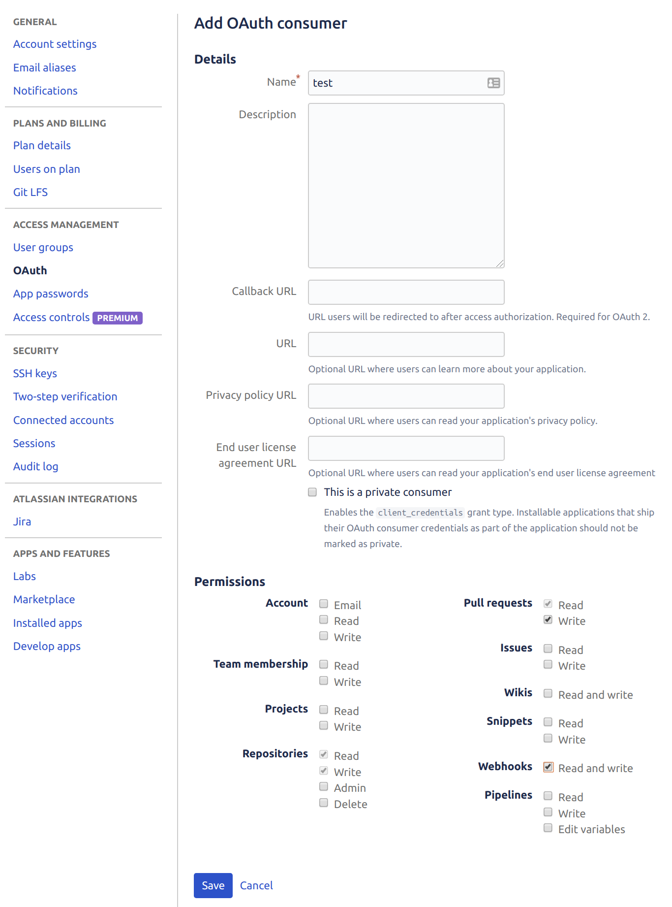
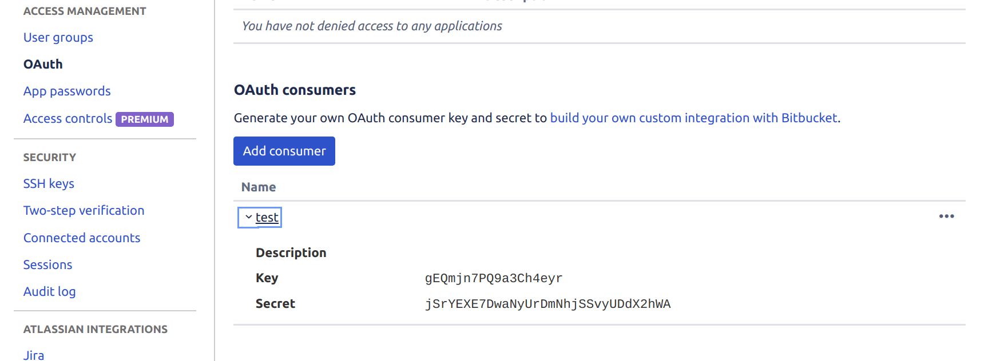

**Description**

  - This is simply a step by step how to set up Bitbucket authentication with Auth0 as a broken.  In particular, this includes refresh token needed to renew the access token.

# Accounts:

Domain: 
    Auth0 account
    Bitbucket domain (main)

User Account:
    Bitbucket user accounts 

# Get Bitbucket client id/secret

   - We need to set up and acquire the main Bitbucket account (not user account) that will be used for Auth0 domain.
    
     * Login into the domain Bitbucket Account
     * Go to "Bitbucket settings" -> Access Management -> OAuth - OAuth consumer
     * Add consumer shown

       

     * Take note of the client id/secret as shown

       

# The Code

   - We will export these environmental variables

        * AUTH0_CLIENT_ID
        * AUTH0_CLIENT_SECRET
        * AUTH0_DOMAIN
        * BITBUCKET_CLIENT_ID
        * BITBUCKET_SECRET

   - The entry point is the method "get_user_access_token", which once the user signs up through Auth0 will:

      * connects to Auth0 and gets the user info including the refresh token
      * use the refresh token to get access token directly from Bitbucket
